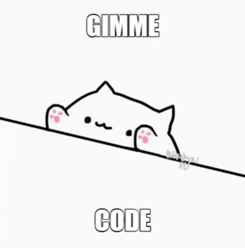

 <h1>Hi there, I'm Inna 🖖🏼 </h1>
 <h3>an indefatigable frontend developer from St.Petersburg</h3>
 
 

- 🔭 I’m currently working on my Language-learning-flashcards app
- 🌱 I’m currently learning React
- 💪🏼 Ask me about training in the gym and building a beautiful body
- ☢️ Сurious fact: I was involved in the design of nuclear power plants around the world 

<h3>Connect with me:</h3>

<h3>Technologies:</h3>

 

 

